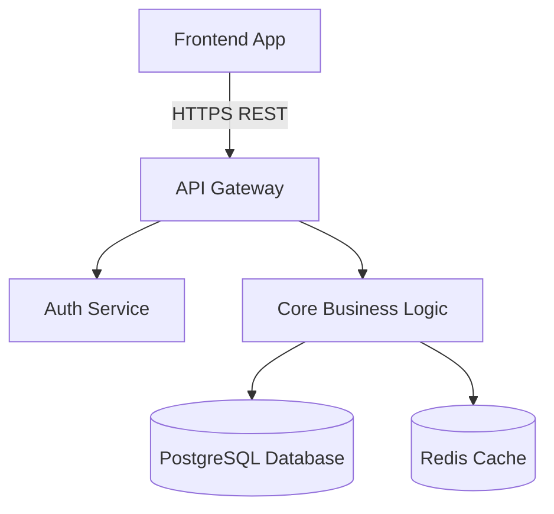
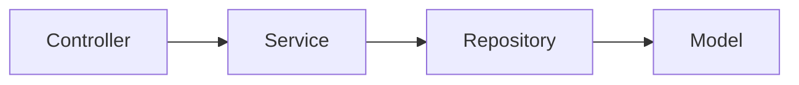
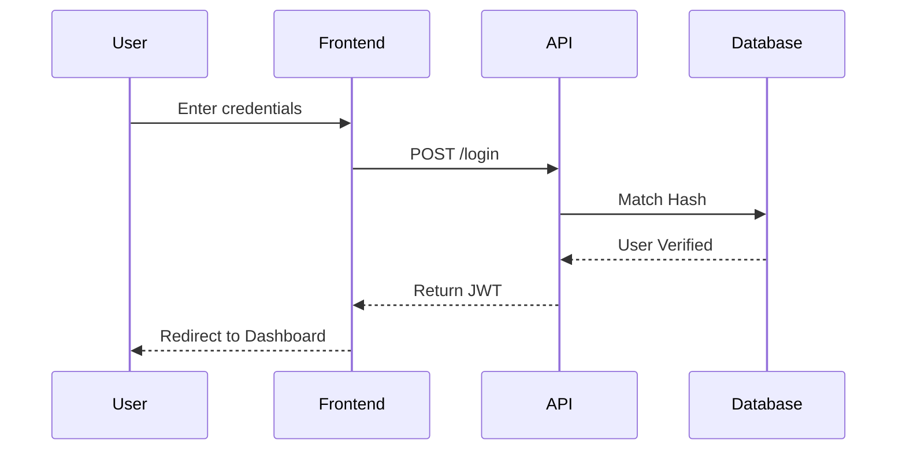
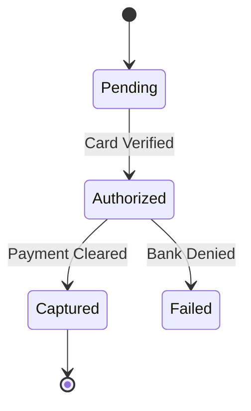

# Diagrams & Graphs (Graph Visualization Engine)

Text documentation is inferior to visual documentation. The Intelligence Engine must embed `Mermaid.js` syntax natively into the Markdown files. GitHub natively renders Mermaid blocks.

## 1. System Architecture Graphs (For `ARCHITECTURE.md`)
Map out the high-level flow of the application stack.
```markdown

```

## 2. Dependency Modules (For `DEPENDENCY_GRAPH.md`)
If the project structure is complex, draw a map of internal code dependencies.
```markdown

```

## 3. Data Flow / Sequence Diagrams (For `DATA_FLOW.md`)
Map out critical interactions involving external APIs or complex synchronous workflows (like Oauth).
```markdown

```

## 4. State & Flow Diagrams (For Complex Logic)
If a service has a complex lifecycle (like a payment cart or long-running worker), use State Diagrams.
```markdown

```

## 5. Markdown Quality Linter Check
The engine must finalize all files with a linter check:
- Ensure no broken hyperlinks.
- Validate that all `` ```mermaid `` blocks are properly closed.
- Generate an Auto Table of Contents at the top of long files using standard `[Label](#label-id)` anchor links.
